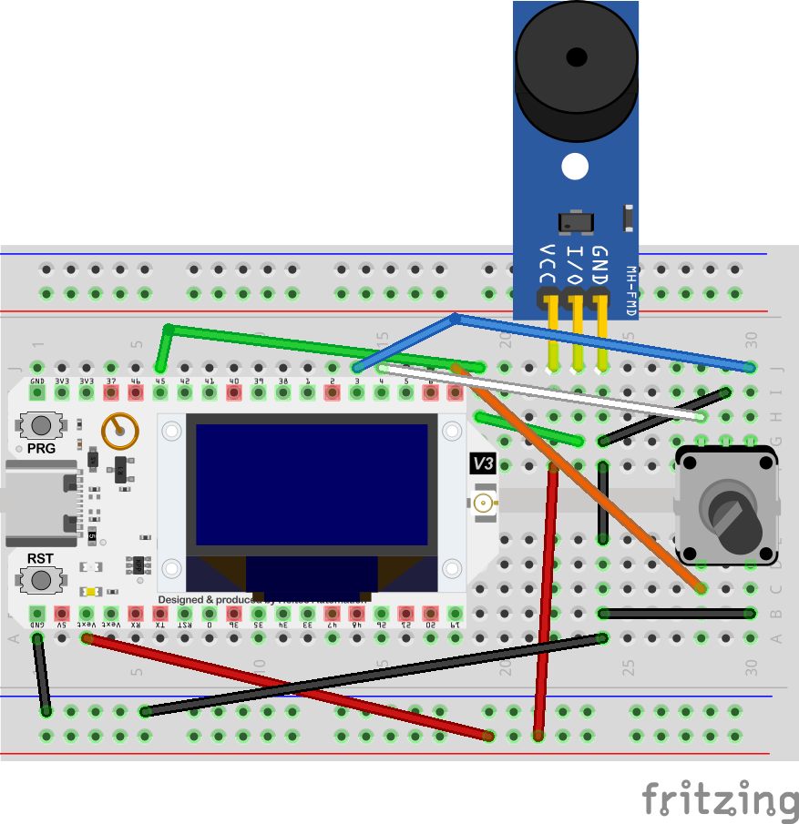

# flagday

off the grid, decentralized cruising. prepared for [**sweeThe4rTs**](https://seattlepride.org/events/sweethearts-a-t4t-art-show), opening February 13, 2026, at Common Objects, Seattle, WA.

## firmware setup

flagday's `firmware` directory is a Git submodule to [anarchivist/meshtastic-firmware](https://github.com/anarchivist/meshtastic/firmware), a light fork of the official Meshtastic firmware distro.

1. prereqs: Git, PlatformIO, and maybe VSCode.
2. clone this repo
3. `git submodule update --init --recursive`

because of how PlatformIO works, you'll need to open up the `firmware` directory in its own VSCode window. annoying, i know. after that, set `env:flagday` as your default project environment and build away.

beyond that, you can more or less just consult the [Building Meshtastic Firmware](https://meshtastic.org/docs/development/firmware/build/) page in the official docs. 

## scripts, scores, and more

the code that generates the score (ringtones) and perhaps other utility code is in a Python project in this repo (see the `flagday` and `tests`) directory. dependencies are managed by `uv`. 

1. prereqs: Python >= 3.14, uv, Lilypond.
2. clone this repo
3. `uv sync`
4. then, e.g., `uv run python -m flagday.composition.maker`

## device configuration

device configuration is handled through the base configuration file in `config/base.yaml`:

```bash
uv run meshtastic -s --port /dev/cu.usbserial-0001 --configure config/base.yaml 
# or uv run meshtastic --ble 'device_name' ... if you want to use Bluetooth instead
```

if you want to merge two configs (e.g. the base config and a device specific config containing ringtone, PSK keys, etc.), use `flagday.config.device`:
```bash
uv run python -m flagday.config.device -c config/base.yaml \
    -o "flagday base 📵" -s "flgB" -f tmp/device_flagdayBase.yaml \
    -r "smbdeath:d=4,o=5,b=90:32c6,32p,32c6,8p,16b,16f6,16p,16f6,16f6.,16e6.,16d6,16c6,16p,16e,16p,16c"
```

you can also use [`yq`](https://mikefarah.gitbook.io/yq):

```bash
yq -r '. *= load("config/base.yaml") | sort_keys(.) | ... comments=""' config/device_flagday2.yaml > tmp/flagday2.yaml
uv run meshtastic -s --port /dev/cu.usbserial-0001 --configure tmp/flagday2.yml
```

channel configuration can be a little persnickety from the CLI app even though `channel_url` is specified, so instead, we can do something like this:

```bash
uv run meshstastic -s --port /dev/cu.usbserial-0001 --ch-index 0 --ch-set name "#public" --ch-set psk $SHARED_KEY
```

## compositon configuration

the default configuration file is `config/composition.yaml`, which expects something like:

```yaml
bpm: 160
series: [9, 3, 4, 11, 5, 7, 2, 0, 8, 1, 6, 10]
```

## prototype


